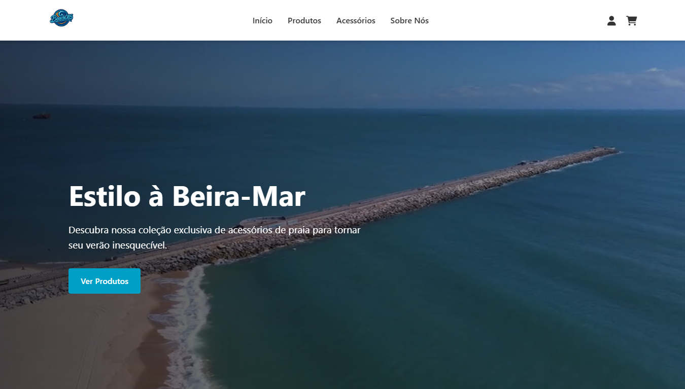
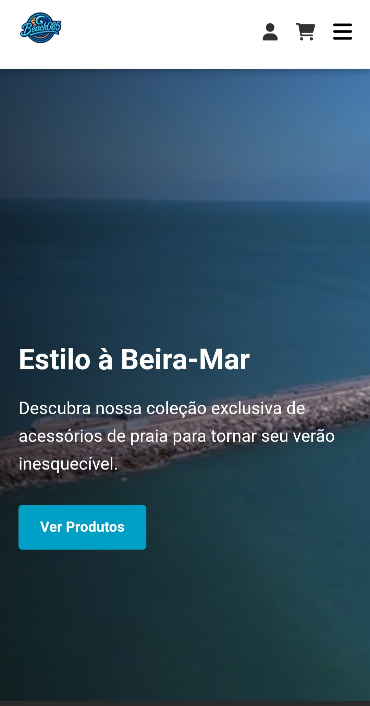

<div align="center">

# 🏖️ Beach085 — Coast Company

**Um e-commerce de acessórios de praia com carrinho funcional, filtros dinâmicos e fluxo completo de loja — tudo em JavaScript vanilla.**



[](https://tuliovitor.github.io/beach085)
[](https://developer.mozilla.org/pt-BR/docs/Web/HTML)
[](https://developer.mozilla.org/pt-BR/docs/Web/CSS)
[](https://developer.mozilla.org/pt-BR/docs/Web/JavaScript)

</div>

---

## 📌 Sobre o projeto

O **Beach085** é um e-commerce fictício de acessórios de praia criado como projeto de portfólio por quatro amigos do segundo ano do ensino médio em Fortaleza — Tulio Vítor, Octávio Marcelo, Paulo Murillo e Arthur Lian. O nome combina a paixão pelas praias com o DDD da cidade (085).

O objetivo do projeto foi ir além de um site estático: implementar um fluxo real de loja, com estado persistido, filtros combinados, carrinho funcional entre páginas e validação de formulários — tudo sem nenhum framework ou biblioteca de UI.

O projeto é composto por 6 páginas integradas, com três áreas de atenção técnica:

- **Gerenciamento de estado do carrinho** via `localStorage`, compartilhado entre todas as páginas
- **Filtros combinados** de categoria, preço, cor e avaliação com reordenação em tempo real
- **Responsividade real** — mobile com menu hambúrguer e desktop com navegação expandida

---

## 🎬 Demonstração

| Desktop | Mobile |
|---|---|
|  |  |

---

## ✨ Funcionalidades

- **Hero com vídeo de fundo** — vídeo da Beira Mar de Fortaleza em loop com texto animado por scroll
- **Catálogo de produtos** com 12 itens, filtros por categoria, faixa de preço e avaliação
- **Catálogo de acessórios** com filtros adicionais de cor (por checkboxes) e mesma lógica de ordenação
- **Carrinho persistente** — itens salvos no `localStorage` e contador atualizado em todas as páginas
- **Sistema de cupons** — códigos `BEACH085`, `PRAIANO` e `ALOISIOLINDO` com percentuais de desconto distintos
- **Página de login/cadastro** com validação de campos, feedback visual e opção "Lembrar de mim"
- **Slider de depoimentos** com autoplay, navegação por pontos e botões anterior/próximo
- **Animações de scroll** customizadas via `data-aos` sem biblioteca externa
- **Botão voltar ao topo** que aparece após 100px de scroll
- **Menu mobile** com hambúrguer e fechamento automático ao navegar

---

## 🧱 Stack

| Tecnologia | Uso |
|---|---|
| HTML5 semântico | 6 páginas: index, produtos, acessórios, carrinho, login e sobre |
| CSS3 com custom properties | Design system compartilhado + CSS modular por página |
| JavaScript vanilla | Estado do carrinho, filtros, slider, animações e validações |
| localStorage | Persistência do carrinho entre páginas e sessões |
| Font Awesome 6 | Ícones de navegação, carrinho, estrelas e contato |

> Nenhuma dependência de frontend além do Font Awesome via CDN. Zero `npm install`.

---

## 🗂️ Estrutura do projeto

```
beach085/
├── index.html          # Home com hero, produtos em destaque, categorias e depoimentos
├── produtos.html       # Catálogo com filtros de categoria, preço e avaliação
├── acessorios.html     # Catálogo com filtros adicionais de cor
├── carrinho.html       # Carrinho com resumo, cupons e finalização
├── login.html          # Login e cadastro com validação
├── sobre.html          # História da equipe, valores e CTA social
├── styles.css          # Design system global
├── css/
│   ├── produtos.css
│   ├── acessorios.css
│   ├── carrinho.css
│   ├── login.css
│   └── sobre.css
└── js/
    ├── script.js       # Comportamentos globais: nav, scroll, slider, animações
    ├── carrinho.js     # Classe CarrinhoManager — toda a lógica do carrinho
    ├── produtos.js     # Dados e filtros da página de produtos
    └── acessorios.js   # Dados e filtros da página de acessórios
```

---

## 🧠 Decisões técnicas

### CarrinhoManager como classe global

O carrinho foi implementado como uma classe instanciada uma única vez e exposta em `window.carrinhoManager`. Isso permite que qualquer página acesse o mesmo estado sem duplicação de lógica:

```javascript
document.addEventListener("DOMContentLoaded", () => {
  if (!window.carrinhoManager) {
    window.carrinhoManager = new CarrinhoManager()
  }
})
```

O guard `if (!window.carrinhoManager)` evita que o `carrinho.js` — carregado em todas as páginas — crie múltiplas instâncias ao navegar.

---

### Carrinho defensivo com validação na leitura

O `localStorage` pode conter dados corrompidos de sessões anteriores. O método `carregarCarrinho()` valida cada item ao ler, descartando silenciosamente entradas inválidas:

```javascript
return carrinho.filter(
  (item) => item.id && item.nome && !isNaN(item.preco) && item.quantidade > 0
)
```

Isso evita erros silenciosos na renderização do carrinho.

---

### Filtros combinados sem recarregar a página

Os filtros de categoria, preço, cor e avaliação são todos aplicados sobre o array em memória — sem nenhuma requisição. A função `mostrarAcessorios()` recalcula e re-renderiza a grade inteira toda vez que qualquer filtro muda, preservando a posição do scroll com `window.pageYOffset`.

---

### Resolução de imagens do carrinho por prefixo de ID

Produtos têm IDs de 1 a 12; acessórios têm IDs começando com `100`. O carrinho usa essa convenção para montar o caminho da imagem corretamente:

```javascript
if (/^[1-9][0-9]?$/.test(item.id)) {
  imagemSrc = `img/produto${item.id}.png`
} else if (item.id.startsWith("100")) {
  imagemSrc = `img/acessorio${item.id.substring(3)}.png`
}
```

Sem essa distinção, acessórios apareceriam com imagens erradas no carrinho.

---

### Botões de carrinho sem event listeners duplicados

Nas páginas de produtos e acessórios, a grade é re-renderizada a cada filtro aplicado. Para evitar que cada re-render adicione um novo listener nos botões, os elementos são clonados antes de receber os eventos:

```javascript
botoesExistentes.forEach(botao => {
  botao.replaceWith(botao.cloneNode(true))
})
```

---

## 📈 Processo de desenvolvimento

| Etapa | O que foi feito |
|---|---|
| 01 | Estrutura HTML das 6 páginas e design system no CSS |
| 02 | Hero com vídeo de fundo e produtos em destaque na home |
| 03 | Catálogo de produtos com filtros e ordenação |
| 04 | Catálogo de acessórios com filtro de cor adicional |
| 05 | Implementação da classe `CarrinhoManager` com `localStorage` |
| 06 | Página do carrinho: renderização dinâmica, resumo e cupons |
| 07 | Página de login com validação e animações de feedback |
| 08 | Página Sobre Nós com equipe e valores |
| 09 | Slider de depoimentos e animações de scroll customizadas |
| 10 | Responsividade completa e ajustes mobile |

---

## 💡 O que eu aprenderia diferente

- Teria criado o `CarrinhoManager` logo no início, antes de qualquer página — integrá-lo depois exigiu revisar todos os botões de adicionar ao carrinho em três arquivos diferentes
- Teria definido a convenção de IDs (produtos vs acessórios) antes de criar os dados, não após perceber o conflito na renderização do carrinho
- Teria separado os dados de produtos em um arquivo `data.js` desde o começo, em vez de deixá-los embutidos nos arquivos de lógica

---

## 👨‍💻 Equipe

| | Nome | Cargo |
|---|---|---|
|  | **Tulio Vítor** | Fundador & Dev |
|  | **Octávio Marcelo** | Designer |
|  | **Paulo Murillo** | CEO |
|  | **Arthur Lian** | Gerente de Produtos |

[](https://instagram.com/beach085_)
[](https://linkedin.com/in/tuliovitor)
[](https://github.com/tuliovitor)

---

<div align="center">

Feito com muito ☀️ e muito 🌊 — em Pacatuba, CE

</div>
